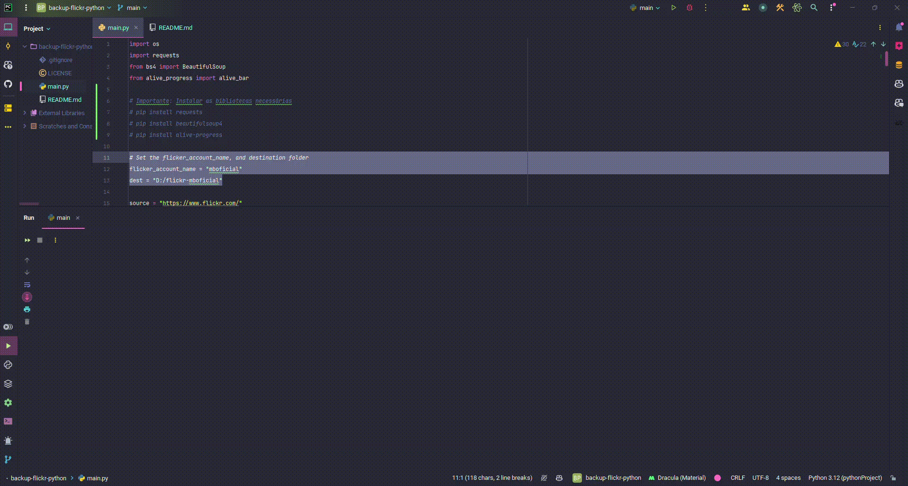

# backup-flickr-python
Backup all photos from a flicker account

## 📦 Quickstart

- **Install with pip** (Python 3.10 or greater):

```shell
pip install requests beautifulsoup4 alive-progress
```

- **After that:** open main.py and set de variables flicker_account_name (the name of the source account) and dest (the local dest folder to save the photos)
```python
# Set the flicker_account_name, and destination folder
flicker_account_name = "mboficial"
dest = "D:/flickr-mboficial"
```
- **Run** the 'main' and follow the outputs. 

# 

## 👋 Contribute

We welcome contributions from developers of all levels. If you'd like to contribute, please feel free to fork the repository and submit your changes as a pull request.